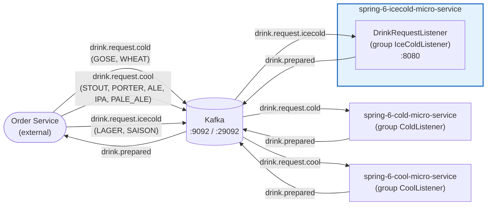

# Spring 6 Ice Cold Microservice

## Abstract

Spring Boot 4 / Spring Framework 6 microservice that prepares ice-cold drinks in a distributed
beer-order flow. It consumes `DrinkRequestEvent` messages from the Kafka topic
`drink.request.icecold`, simulates preparing the drink, and publishes a `DrinkPreparedEvent` to the
`drink.prepared` topic. The event DTOs come from the shared `spring-6-rest-mvc-api` module.

The service has no business REST API — it exposes only Spring Actuator endpoints (health, info,
metrics) on port `8080`. Kafka topics and bootstrap servers are configured in `application.yaml`;
Kafka runs locally via `compose.yaml` or as a Helm subchart in Kubernetes.

The Maven build (Java 25) produces the Docker image and the Helm chart
`spring-6-icecold-micro-service-chart` from a single version tag. Logs are structured (Logstash JSON
with MDC trace/span IDs) and tracing uses W3C propagation. Deployment is Helm-only into the
`spring-6-icecold-micro-service` namespace.

## Architecture Overview

This service is one participant of the drink-preparation saga. An external order service routes
drink requests to one of three drink microservices based on the beer style. Each drink microservice
publishes a `drink.prepared` event once the drink is ready, which the order service consumes.



### Message Flow

|          Topic          |                    Produced by                    |              Consumed by (group)               |
|-------------------------|---------------------------------------------------|------------------------------------------------|
| `drink.request.cold`    | order service (GOSE, WHEAT)                       | `spring-6-cold-micro-service` (`ColdListener`) |
| `drink.request.cool`    | order service (STOUT, PORTER, ALE, IPA, PALE_ALE) | `spring-6-cool-micro-service` (`CoolListener`) |
| `drink.request.icecold` | order service (LAGER, SAISON)                     | **this service** (`IceColdListener`)           |
| `drink.prepared`        | all drink microservices                           | order service                                  |

## Deployment with Helm

Be aware that we are using a different namespace here (not default).

To run maven filtering for destination target/helm

```bash
./mvnw clean install -DskipTests
```

Go to the directory where the tgz file has been created after 'mvn install'

```powershell
cd target/helm/repo
```

unpack

```powershell
$file = Get-ChildItem -Filter spring-6-icecold-micro-service-chart-*.tgz | Select-Object -First 1
tar -xvf $file.Name
```

install

```powershell
$APPLICATION_NAME = Get-ChildItem -Directory | Where-Object { $_.LastWriteTime -ge $file.LastWriteTime } | Select-Object -ExpandProperty Name
helm upgrade --install $APPLICATION_NAME ./$APPLICATION_NAME --namespace spring-6-icecold-micro-service --create-namespace --wait --timeout 8m --debug --render-subchart-notes
```

show logs

```powershell
kubectl get pods -n spring-6-icecold-micro-service
```

replace $POD with pods from the command above

```powershell
kubectl logs $POD -n spring-6-icecold-micro-service --all-containers
```

test

```powershell
helm test $APPLICATION_NAME --namespace spring-6-icecold-micro-service --logs
```

uninstall

```powershell
helm uninstall $APPLICATION_NAME --namespace spring-6-icecold-micro-service
```

delete all

```powershell
kubectl delete all --all -n spring-6-icecold-micro-service
```

create busybox sidecar

```powershell
kubectl run busybox-test --rm -it --image=busybox:1.38.0 --namespace=spring-6-icecold-micro-service --command -- sh
```

and analyze kafka connections

```powershell
nslookup spring-6-icecold-micro-service-kafka.spring-6-icecold-micro-service.svc.cluster.local

nc -zv spring-6-icecold-micro-service-kafka.spring-6-icecold-micro-service.svc.cluster.local 29092
echo "Exit code for port 29092: $?"
```

create kafka sidecar

```powershell
kubectl run kafka-test --rm -it --image=apache/kafka:4.3.1 --namespace=spring-6-icecold-micro-service --command -- bash
```

run kafka commands

```powershell
cd /opt/kafka/bin
./kafka-topics.sh --bootstrap-server spring-6-icecold-micro-service-kafka.spring-6-icecold-micro-service.svc.cluster.local:29092 --list
```

You can use the actuator rest call to verify via port 30080

## Sandbox (local dev environment)

The sandbox is provisioned by the opencode-sandbox-kit and runs as a Docker container. It mounts this
repo, starts the agent, and connects the IntelliJ MCP server. The app runs on port `8080`; `compose.yaml`
provides Kafka.

Allow the kit source (GitHub without cloning):

```powershell
sbx settings set kit.allowedSources --% "[\"docker.io/\",\"github.com/dboeckli/\"]"
```

Start a new sandbox:

```powershell
sbx run opencode `
    --kit "git+https://github.com/dboeckli/opencode-sandbox-kit.git#dir=opencode-agent" `
    --template docker.io/domboeckli/sbx-opencode-tooling:latest `
    --skills=off `
    --static-mcp idea `
    . `
    "C:\development\maven-repo:ro"
```

Start the sandbox with Kubernetes support:

```powershell
sbx run opencode `
    --kit "git+https://github.com/dboeckli/opencode-sandbox-kit.git#dir=opencode-agent" `
    --template docker.io/domboeckli/sbx-opencode-tooling:latest `
    --skills=off `
    --static-mcp idea `
    . `
    "C:\development\maven-repo:ro" `
    "$env:USERPROFILE\.kube:ro"
```

Claude Code (Home) and Mammouth Code variants:

```powershell
sbx run claude `
    --kit "git+https://github.com/dboeckli/opencode-sandbox-kit.git#dir=opencode-agent" `
    --template docker.io/domboeckli/sbx-claude-tooling:latest `
    --skills=off `
    --static-mcp idea `
    . `
    "C:\development\maven-repo:ro"
```

```powershell
sbx run "git+https://github.com/dboeckli/opencode-sandbox-kit.git#dir=mammouth-agent" `
    --kit-arg imageTag=latest `
    --skills=off `
    --static-mcp idea `
    . `
    "C:\development\maven-repo:ro"
```

### Start the app

Kafka can be started manually (otherwise it starts with the app):

```shell
docker compose up
```

Then run the `Spring6IcecoldMicroServiceApplication` run configuration in IntelliJ
(`.run/Spring6IcecoldMicroServiceApplication.run.xml`) or start via `./mvnw spring-boot:run`.

### Sandbox build quirk

The sandbox mounts the repo via filesystem passthrough, which blocks symlinks — Spotless's `npm install`
(prettier) would fail with `EPERM` unless npm skips bin links. The kit sets `npm_config_bin_links=false`
globally, so no manual export is needed.
